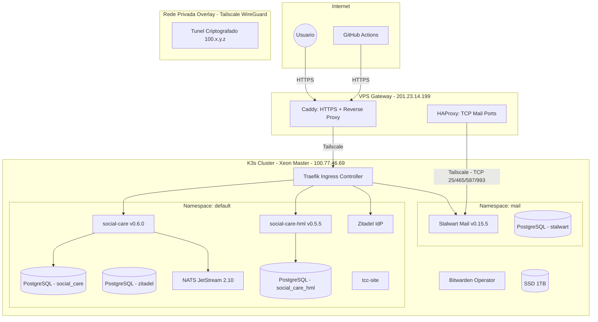

# Arquitetura da ACDG Edge Cloud

Nuvem privada com hardware local: a conveniencia de cloud publica com soberania de dados e baixo custo.

## Visao Geral

Hardware heterogeneo (Xeon + Raspberry Pis) abstraido por K3s (Kubernetes leve). O estado desejado da infra vive no GitHub — se o hardware pegar fogo, basta reconectar e o FluxCD reconstroi tudo a partir deste repositorio.

## Diagrama de Rede



## Stack de Tecnologias

| Tecnologia | Funcao | Por que |
|------------|--------|---------|
| **K3s** | Orquestrador | Kubernetes emagrecido, 512MB RAM, roda em Raspberry Pi |
| **FluxCD** | GitOps | Modelo pull — servidor puxa mudancas, sem expor portas |
| **Tailscale** | Rede overlay | WireGuard mesh, NAT-agnostic, IP fixo 100.x.y.z |
| **Caddy** | Gateway HTTPS | Certificados Let's Encrypt automaticos |
| **HAProxy** | TCP proxy | Portas de e-mail (25, 465, 587, 993) que Caddy nao suporta |
| **Traefik** | Ingress K8s | Roteamento por Host header dentro do cluster |
| **PostgreSQL 15** | Banco de dados | Database-per-service (4 instancias isoladas) |
| **NATS JetStream** | Mensageria | Event streaming com retencao de 30 dias |
| **Zitadel** | Identity Provider | OIDC self-hosted, RBAC, PKCE |
| **Stalwart** | Mail server | SMTP/IMAP/JMAP all-in-one |
| **Bitwarden** | Secrets | Zero secrets em Git, sync via operator |

## Servicos Ativos

| Servico | Dominio | Versao | Descricao |
|---------|---------|--------|-----------|
| social-care | `social-care.acdgbrasil.com.br` | v0.6.0 | API de assistencia social (prod) |
| social-care-hml | `social-care-hml.acdgbrasil.com.br` | v0.5.5 | Ambiente de homologacao |
| Zitadel | `auth.acdgbrasil.com.br` | Helm chart | Identity Provider OIDC |
| Stalwart | `mail.acdgbrasil.com.br` | v0.15.5 | Servidor de e-mail |
| tcc-site | `tcc.acdgbrasil.com.br` | — | Conteudo academico (static) |
| NATS | interno (4222) | 2.10-alpine | Message broker JetStream |

## Bancos de Dados (Database-per-Service)

| Instancia | Database | User | Storage | Namespace |
|-----------|----------|------|---------|-----------|
| postgres | `social_care` | `postgres` | 10 Gi | default |
| postgres-zitadel | `zitadel` | `zitadel` | 10 Gi | default |
| postgres-hml | `social_care_hml` | `social_care_hml` | 2 Gi | default |
| postgres-stalwart | `stalwart` | `stalwart` | 5 Gi | mail |

Todas as instancias usam `nodeSelector: hardware-type: high-performance` para rodar no SSD do Xeon.

## Estrutura do Repositorio

```
edge-cloud-infra/
├── apps/                          # Manifests de aplicacao (namespace default)
│   ├── social-care.yaml           # Producao (Deployment + Service + Ingress)
│   ├── social-care-hml.yaml       # HML (Deployment + DB + CronJob reset)
│   ├── postgres.yaml              # PostgreSQL principal
│   ├── postgres-zitadel.yaml      # PostgreSQL do Zitadel
│   ├── nats.yaml                  # NATS JetStream + stream setup job
│   ├── zitadel.yaml               # HelmRelease + Ingress
│   └── tcc-site.yaml              # Site estatico
├── mail/                          # Namespace mail
│   ├── namespace.yaml
│   ├── stalwart.yaml              # Stalwart Mail (Deployment + Services + Ingress)
│   └── postgres-stalwart.yaml     # PostgreSQL do Stalwart
├── clusters/master-xeon/          # FluxCD config
│   ├── apps.yaml                  # Kustomization → ./apps (1min)
│   ├── mail.yaml                  # Kustomization → ./mail (5min)
│   ├── zitadel-repo.yaml          # HelmRepository charts.zitadel.com
│   └── flux-system/               # Componentes FluxCD
└── docs/                          # Documentacao operacional
```

## Ciclo de Vida: Novo Servico

### Passo 1: Imagem Docker
Crie o codigo e configure GitHub Actions para build + push no GHCR:
```
ghcr.io/acdgbrasil/meu-servico:v1.0.0
```

### Passo 2: Manifest
Crie `apps/meu-servico.yaml` com Deployment, Service e Ingress:
```yaml
apiVersion: networking.k8s.io/v1
kind: Ingress
metadata:
  name: meu-servico-ingress
spec:
  rules:
  - host: meu-servico.acdgbrasil.com.br
    http:
      paths:
      - path: /
        pathType: Prefix
        backend:
          service:
            name: meu-servico
            port:
              number: 80
```

### Passo 3: Gateway (VPS)
SSH na VPS e adicione no Caddyfile:
```caddy
meu-servico.acdgbrasil.com.br {
    reverse_proxy 100.77.46.69:80
}
```
```bash
sudo systemctl reload caddy
```

### Resultado
FluxCD detecta o manifest (passo 2), K3s puxa a imagem (passo 1), Caddy roteia o trafego com HTTPS automatico (passo 3).

## Dimensao Academica

Esta infraestrutura faz parte de um TCC (Living Paper). O conteudo academico esta em [tcc.acdgbrasil.com.br](https://tcc.acdgbrasil.com.br), hospedado pela propria nuvem que descreve.
