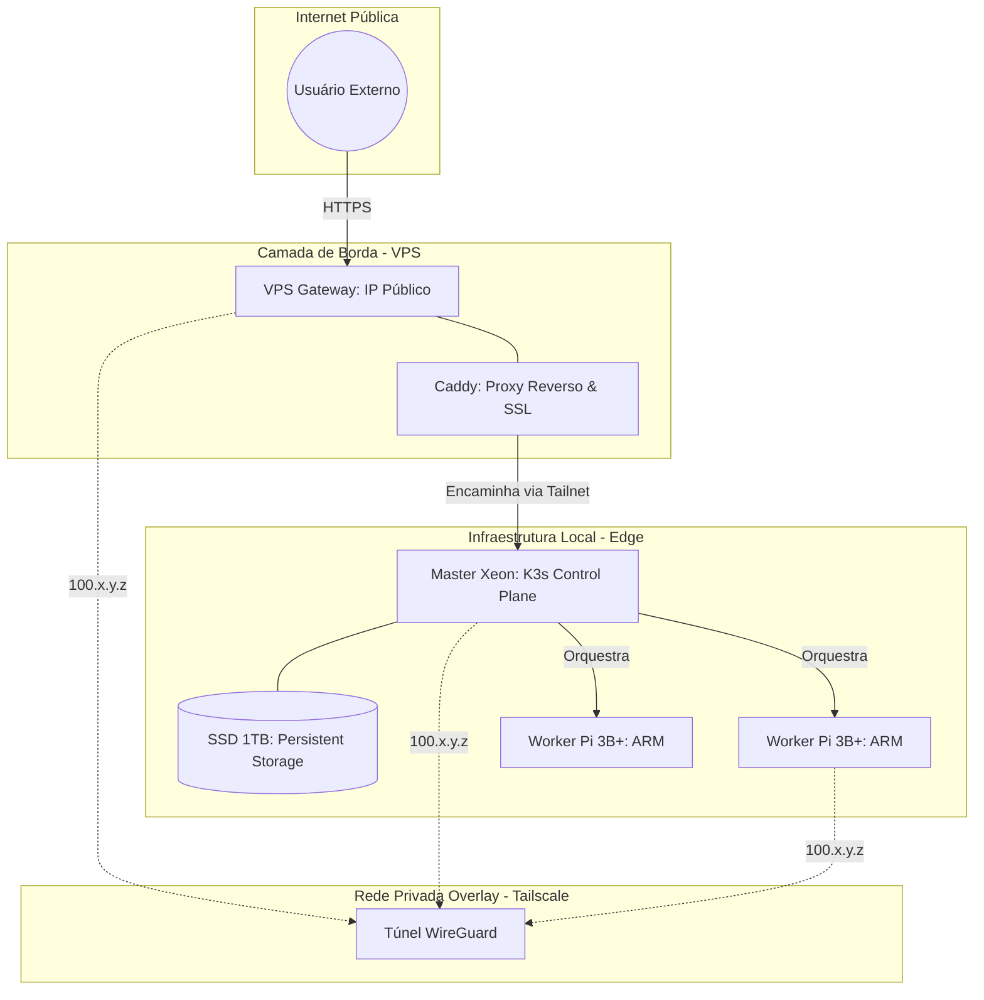

# Arquitetura e Fundamentos da ACDG Edge Cloud 🏗️

Este documento detalha a visão, os fundamentos teóricos e as decisões técnicas por trás da infraestrutura de nuvem privada da **ACDG Brasil**.

## 1. A Visão: "Nuvem Pública com Hardware Privado"
A ideia central é abstrair a complexidade do hardware físico e transformar servidores heterogêneos (um Xeon potente e vários Raspberry Pis limitados) em uma **entidade única e programável**. Queremos a conveniência de um Google Cloud ou AWS, mas mantendo a soberania dos dados e o baixo custo do hardware local.

## 2. Diagrama da Rede (Mermaid)



---

## 3. Fundamentos Teóricos

### A. GitOps (Source of Truth)
O estado desejado da nossa infraestrutura não está nos servidores, mas no **GitHub**. Se o servidor pegar fogo, basta conectar um hardware novo, rodar o script de bootstrap e o sistema se reconstrói sozinho a partir deste repositório.

### B. Edge Computing Híbrida
Diferente da nuvem tradicional (onde tudo é potente), a Edge Computing lida com hardware "na borda". Nossa arquitetura é híbrida:
*   **Xeon (Heavy Lifting):** Processamento pesado e persistência de dados (Bancos de Dados).
*   **Raspberry Pis (Microservices):** APIs leves, sensores e automações.

### C. Segurança "Zero Trust"
Nenhum hardware local expõe portas para a internet. O firewall bloqueia tudo. A única porta de entrada é a VPS, e a única forma de chegar ao Xeon é através de um túnel criptografado e autenticado.

---

## 4. Fundamentos de Rede (Networking)

Utilizamos uma **Overlay Network (Rede de Sobreposição)**.
*   **Tailscale (WireGuard):** Cria uma rede virtual (camada 3) por cima da internet comum. Ela resolve problemas de NAT e IP dinâmico automaticamente. Cada máquina recebe um IP único (100.x.y.z) que nunca muda, não importa onde ela esteja plugada.
*   **VPS Gateway:** Funciona como um "Bouncer" (Ledo). Ele tem o único IP fixo público. Ele recebe a requisição, termina o SSL e a despacha para o destino correto dentro da rede privada.

---

## 5. Por que estas tecnologias? (The Tech Stack)

### K3s (Kubernetes) vs Outros
*   **Por que K3s?** É o padrão da indústria mas emagrecido. Consome apenas 512MB de RAM, permitindo que os Raspberry Pis de 1GB rodem o sistema.
*   **Por que não Docker Swarm?** O Swarm é mais simples, mas o Kubernetes (K3s) tem um ecossistema gigante (como o Operador da Bitwarden e o FluxCD) que o Swarm não possui.

### FluxCD vs Jenkins/CI Tradicional
*   **Por que FluxCD?** Ele usa o modelo "Pull". O servidor puxa as mudanças. Isso é muito mais seguro do que o GitHub tentar "empurrar" mudanças para dentro de um servidor protegido por firewall.

### Caddy vs Nginx/Apache
*   **Por que Caddy?** Pela automação total de certificados HTTPS. No Nginx, precisaríamos de scripts complexos com Certbot. No Caddy, basta escrever o nome do domínio.

---

## 6. Por que não outras soluções?

*   **Por que não VPN tradicional (OpenVPN)?** O OpenVPN é centralizado (se o servidor VPN cai, tudo cai) e complexo de configurar certificados. O Tailscale é Mesh (P2P), mais rápido e seguro.
*   **Por que não usar o disco do Raspberry Pi?** Cartões SD corrompem com facilidade em bancos de dados. Por isso, centralizamos toda a persistência no **SSD de 1TB do Xeon**.

---
**ACDG Brasil - Engenharia de Nuvem Privada**

---

## 7. Ciclo de Vida: Criando um Novo Microserviço 🚀

Para que um novo serviço (ex: `minha-api`) ganhe vida e um subdomínio automático (`api.acdgbrasil.com.br`), siga este fluxo:

### Passo 1: O Repositório do Código (GitHub Actions)
1. Crie o código da sua aplicação em um novo repositório (ex: `acdgbrasil/minha-api`).
2. Configure um **GitHub Action** para:
   * Realizar o build da imagem Docker.
   * Fazer o push para o **GHCR** (GitHub Container Registry) da organização: `ghcr.io/acdgbrasil/minha-api:latest`.

### Passo 2: O Manifesto de Infraestrutura (Este Repositório)
Neste repositório (`edge-cloud-infra`), crie o arquivo `apps/minha-api.yaml`:
```yaml
# Deployment, Service e Ingress
apiVersion: networking.k8s.io/v1
kind: Ingress
metadata:
  name: minha-api-ingress
spec:
  rules:
  - host: api.acdgbrasil.com.br # Nome do subdomínio desejado
    http:
      paths:
      - path: /
        pathType: Prefix
        backend:
          service:
            name: minha-api
            port:
              number: 80
```

### Passo 3: O Gateway (VPS)
Acesse a VPS e adicione o novo subdomínio no Caddyfile:
```bash
# Na VPS: sudo nano /etc/caddy/Caddyfile
api.acdgbrasil.com.br {
    reverse_proxy 100.77.46.69:80
}
# Recarregue: sudo systemctl reload caddy
```

### Resultado Final
O **FluxCD** detectará a mudança no passo 2, o **K3s** baixará a imagem criada no passo 1, e o **Caddy** no passo 3 passará a entregar o tráfego com HTTPS automático.

---

---

## 8. Dimensão Acadêmica (Living Paper) 🎓

Esta infraestrutura foi concebida como parte de um **Trabalho de Conclusão de Curso (TCC)**. Diferente de artigos estáticos, este projeto utiliza o conceito de "Living Paper":
*   **Acesso:** O conteúdo acadêmico está disponível em [tcc.acdgbrasil.com.br](https://tcc.acdgbrasil.com.br).
*   **Transparência:** O texto é escrito em Markdown e versionado em tempo real.
*   **Hospedagem:** O próprio objeto de estudo (a nuvem) hospeda o artigo científico que a descreve.

---
