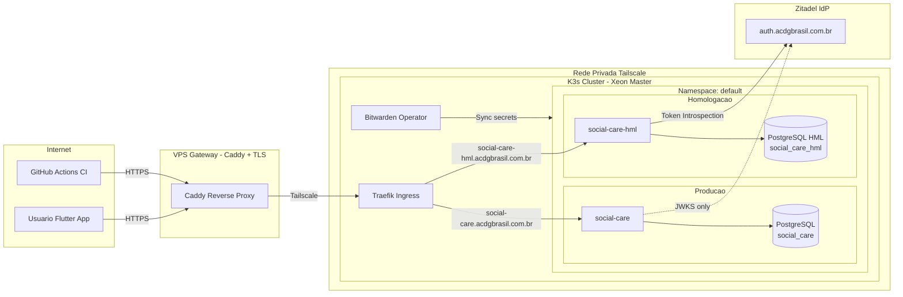
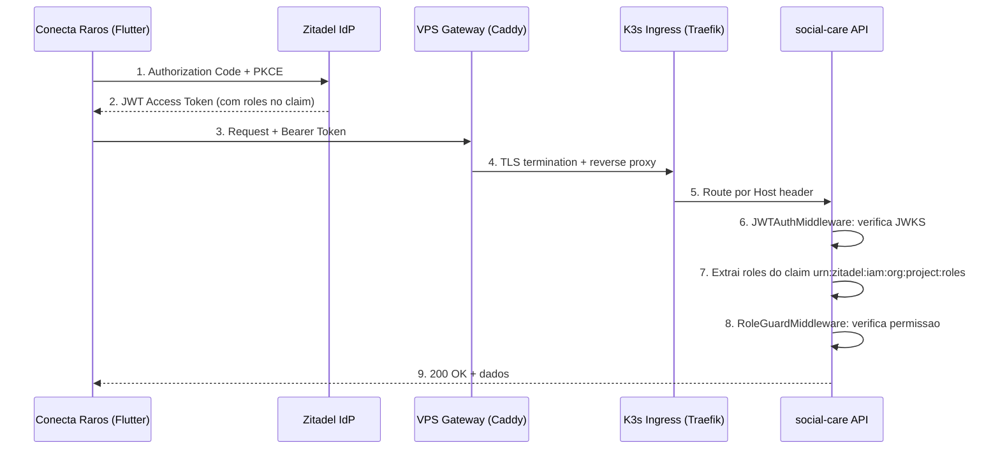
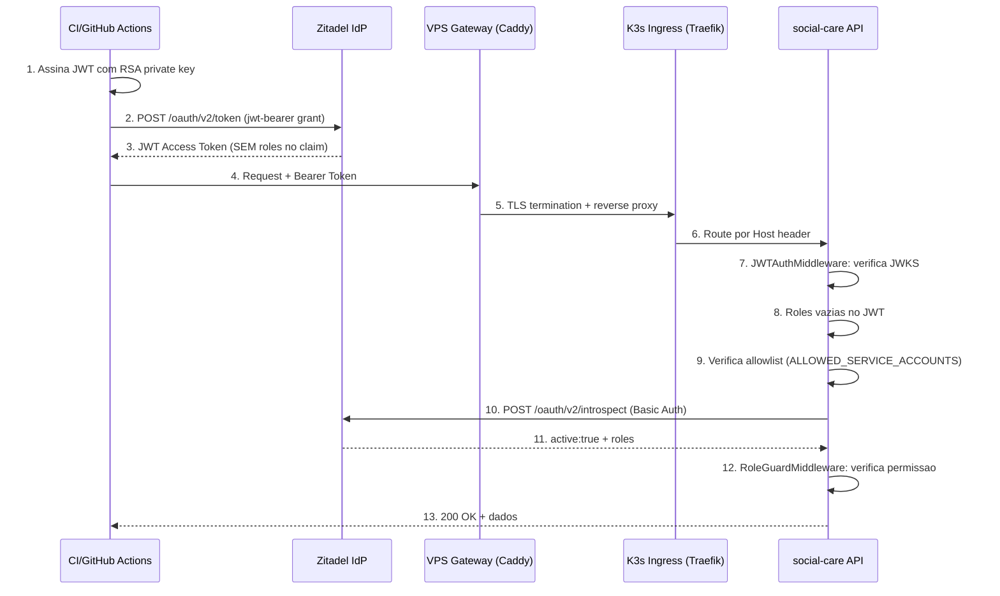
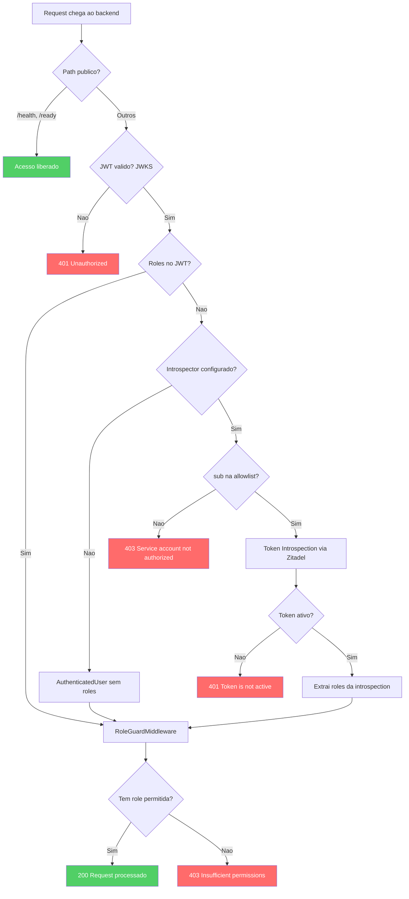
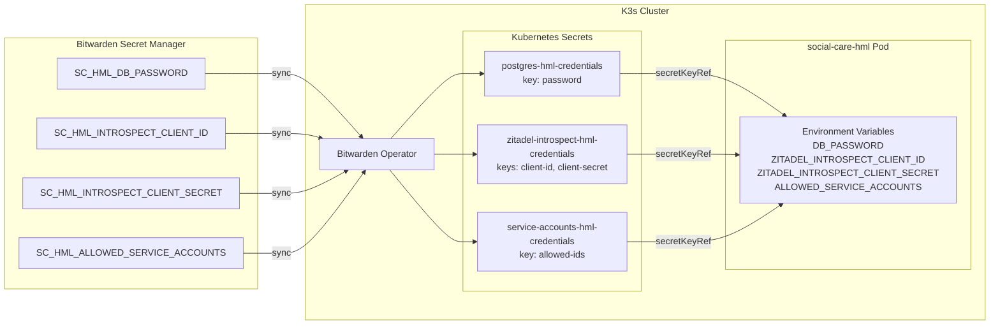

# Seguranca — Autenticacao, Autorizacao e Protecao do Ambiente

Documentacao completa do modelo de seguranca aplicado aos servicos da ACDG Platform,
com foco no servico `social-care` e no ambiente de homologacao (HML).

**Data de implementacao:** Marco 2026
**Ultima atualizacao:** 11 de Marco de 2026

---

## Indice

1. [Visao Geral](#1-visao-geral)
2. [Topologia de Rede](#2-topologia-de-rede)
3. [Identity Provider — Zitadel](#3-identity-provider--zitadel)
4. [Autenticacao — JWT via JWKS](#4-autenticacao--jwt-via-jwks)
5. [Autorizacao — RBAC por Roles](#5-autorizacao--rbac-por-roles)
6. [Token Introspection — Fallback para Service Accounts](#6-token-introspection--fallback-para-service-accounts)
7. [Allowlist de Service Accounts](#7-allowlist-de-service-accounts)
8. [Defesa em Profundidade — Fluxo Completo](#8-defesa-em-profundidade--fluxo-completo)
9. [Gestao de Secrets — Bitwarden Secret Manager](#9-gestao-de-secrets--bitwarden-secret-manager)
10. [Isolamento Producao vs Homologacao](#10-isolamento-producao-vs-homologacao)
11. [Componentes Zitadel](#11-componentes-zitadel)
12. [Matriz de Ameacas e Mitigacoes](#12-matriz-de-ameacas-e-mitigacoes)
13. [Referencia de Arquivos](#13-referencia-de-arquivos)
14. [RFCs e Padroes](#14-rfcs-e-padroes)

---

## 1. Visao Geral

O modelo de seguranca segue o principio de **defesa em profundidade** (defense in depth),
com multiplas camadas independentes de protecao. Nenhuma camada sozinha e suficiente;
a seguranca depende da combinacao de todas.

| Camada | Mecanismo | Onde |
|--------|-----------|------|
| 1. Rede | Tailscale (WireGuard) — rede privada overlay | VPS ↔ K3s |
| 2. TLS | Caddy — certificado Let's Encrypt automatico | VPS Gateway |
| 3. Assinatura | JWKS — verifica assinatura RSA do JWT | Backend (middleware) |
| 4. Autorizacao | RBAC — roles no JWT ou via introspection | Backend (middleware) |
| 5. Allowlist | IDs de service accounts autorizados (Bitwarden) | Backend (middleware) |
| 6. Secrets | Bitwarden Secret Manager — zero secrets em Git | K8s (operator) |
| 7. Isolamento | Banco de dados e deployment separados por ambiente | K8s |

---

## 2. Topologia de Rede



**Pontos criticos:**

- O trafego da internet **nunca** chega diretamente ao K3s. Passa obrigatoriamente pelo Caddy (TLS) e Tailscale (WireGuard).
- O Traefik roteia pelo header `Host` — cada subdominio aponta para o deployment correto.
- O Zitadel e acessado tanto pelo frontend (para login) quanto pelo backend HML (para introspection).
- Producao **nao** faz introspection — usa apenas JWKS para verificar assinaturas JWT.

---

## 3. Identity Provider — Zitadel

| Item | Valor |
|------|-------|
| **Tipo** | Self-hosted (K3s via Helm chart + FluxCD) |
| **Dominio** | `https://auth.acdgbrasil.com.br` |
| **Console** | `https://auth.acdgbrasil.com.br/ui/console` |
| **JWKS URI** | `https://auth.acdgbrasil.com.br/oauth/v2/keys` |
| **Token Endpoint** | `https://auth.acdgbrasil.com.br/oauth/v2/token` |
| **Introspect Endpoint** | `https://auth.acdgbrasil.com.br/oauth/v2/introspect` |
| **Issuer** | `https://auth.acdgbrasil.com.br` |
| **Projeto** | ACDG Platform (ID: `363109883022671995`) |

### Applications no Zitadel

| App | Tipo | Uso | Auth Method |
|-----|------|-----|-------------|
| `social-care` | Native (OIDC) | Flutter app — login de usuarios humanos | PKCE |
| `social-care-web` | User Agent (OIDC) | Web app (futuro) | PKCE |
| `social-care-introspect` | API | Backend HML — Token Introspection | Basic (client_id:client_secret) |

### Roles definidas no projeto

| Role | Descricao | Permissoes no backend |
|------|-----------|----------------------|
| `social_worker` | Assistente social | CRUD completo (leitura + escrita) |
| `owner` | Responsavel/familiar | Somente leitura dos proprios dados |
| `admin` | Administrador | Leitura + gestao |

---

## 4. Autenticacao — JWT via JWKS

### Fluxo: Usuario humano (Authorization Code + PKCE)



### Como funciona

1. **JWKS (JSON Web Key Set):** Na inicializacao, o backend busca as chaves publicas do Zitadel em `JWKS_URL`. Essas chaves sao usadas para verificar a assinatura RSA de cada JWT recebido.

2. **Verificacao:** Cada request (exceto `/health` e `/ready`) passa pelo `JWTAuthMiddleware`, que:
   - Extrai o token do header `Authorization: Bearer <token>`
   - Verifica a assinatura contra as chaves JWKS
   - Verifica que o token nao expirou (`exp` claim)
   - Extrai o `sub` (user ID) e roles do claim `urn:zitadel:iam:org:project:roles`

3. **Resultado:** Um `AuthenticatedUser` e armazenado no `Request.storage` com `userId` e `roles`, disponivel para todos os handlers downstream.

### Claim de roles no JWT (formato Zitadel)

```json
{
  "sub": "363680401698324682",
  "urn:zitadel:iam:org:project:roles": {
    "social_worker": {
      "363109592139300987": "acdg.auth.acdgbrasil.com.br"
    }
  }
}
```

O backend extrai apenas as **chaves** do dicionario de roles (ex: `social_worker`).

---

## 5. Autorizacao — RBAC por Roles

O `RoleGuardMiddleware` e aplicado por grupo de rotas. Cada controller define quais roles podem acessar quais operacoes.

### Mapa de permissoes

| Controller | Operacao | Roles permitidas |
|------------|----------|-----------------|
| `HealthController` | `GET /health`, `GET /ready` | **Publico** (sem autenticacao) |
| `PatientController` | `GET` (leitura) | `social_worker`, `owner`, `admin` |
| `PatientController` | `POST`, `PUT`, `DELETE` (escrita) | `social_worker` |
| `AssessmentController` | `PUT` (atualizacao) | `social_worker` |
| `CareController` | `POST`, `PUT` (escrita) | `social_worker` |
| `ProtectionController` | `POST`, `PUT` (escrita) | `social_worker` |
| `LookupController` | `GET` (leitura) | `social_worker`, `owner`, `admin` |

### Implementacao

```swift
// Exemplo: PatientController
let read = patients.grouped(RoleGuardMiddleware("social_worker", "owner", "admin"))
let write = patients.grouped(RoleGuardMiddleware("social_worker"))
```

O middleware verifica `AuthenticatedUser.hasAnyRole(allowed)` — se o usuario nao tem nenhuma das roles permitidas, retorna `403 Forbidden`.

---

## 6. Token Introspection — Fallback para Service Accounts

### O problema

O Zitadel **nao inclui roles no JWT** para service users autenticados via **JWT Profile grant** (`urn:ietf:params:oauth:grant-type:jwt-bearer`, RFC 7523). Isso e uma limitacao conhecida do Zitadel — o token e valido e assinado, mas o claim `urn:zitadel:iam:org:project:roles` nao esta presente.

Isso impede que service accounts (usados para automacao e testes de integracao) acessem endpoints protegidos por role.

### A solucao: Token Introspection (RFC 7662)

Quando o JWT nao contem roles, o backend chama o endpoint de **Token Introspection** do Zitadel para obter as roles associadas ao service user.



### Detalhes tecnicos

**Endpoint:** `POST https://auth.acdgbrasil.com.br/oauth/v2/introspect`

**Autenticacao da chamada:** Basic Auth com `client_id:client_secret` da API app `social-care-introspect`.

**Request:**
```
POST /oauth/v2/introspect
Authorization: Basic base64(client_id:client_secret)
Content-Type: application/x-www-form-urlencoded

token=<access_token_do_service_user>
```

**Response (sucesso):**
```json
{
  "active": true,
  "sub": "363680401698324682",
  "client_id": "svc-hml-tests",
  "urn:zitadel:iam:org:project:roles": {
    "social_worker": { "363109592139300987": "acdg.auth.acdgbrasil.com.br" },
    "admin": { "363109592139300987": "acdg.auth.acdgbrasil.com.br" },
    "owner": { "363109592139300987": "acdg.auth.acdgbrasil.com.br" }
  }
}
```

### Quando o introspection e ativado

O introspection so executa quando **TODAS** as condicoes sao verdadeiras:

1. O JWT e valido (assinatura verificada por JWKS)
2. O JWT **nao** contem roles no claim
3. As env vars `ZITADEL_INTROSPECT_CLIENT_ID` e `ZITADEL_INTROSPECT_CLIENT_SECRET` estao definidas
4. O `sub` do JWT esta na allowlist `ALLOWED_SERVICE_ACCOUNTS`

Em producao, as env vars de introspection **nao estao definidas**, portanto o introspection **nunca executa**.

---

## 7. Allowlist de Service Accounts

### O problema

Sem allowlist, qualquer JWT valido sem roles no claim poderia triggerar introspection — mesmo em producao se alguem adicionasse as env vars por engano.

### A solucao

Uma lista explicita de user IDs autorizados a usar introspection, armazenada no **Bitwarden Secret Manager** (nunca hardcoded).

```
ALLOWED_SERVICE_ACCOUNTS=363680401698324682
```

O formato e comma-separated para suportar multiplos service accounts no futuro:

```
ALLOWED_SERVICE_ACCOUNTS=id1,id2,id3
```

### Fluxo de verificacao

```
JWT valido → roles vazias → introspector configurado?
  → SIM → sub na allowlist?
    → SIM → introspection → roles obtidas
    → NAO → 403 "Service account not authorized"
  → NAO → AuthenticatedUser sem roles → 403 no RoleGuard
```

### Tres camadas de protecao

| Camada | Mecanismo | O que protege |
|--------|-----------|---------------|
| **JWKS** | Verificacao de assinatura RSA | Impede JWTs forjados ou manipulados |
| **Env vars** | Introspection so ativa se configurado | Producao nunca faz introspection |
| **Allowlist** | IDs especificos no Bitwarden | Mesmo com env vars, so IDs autorizados passam |

---

## 8. Defesa em Profundidade — Fluxo Completo



### Cenarios de ataque e resultado

| Cenario | Resultado | Motivo |
|---------|-----------|--------|
| JWT forjado (assinatura invalida) | **401** | JWKS rejeita — chave publica nao confere |
| JWT expirado | **401** | `exp` claim verificado pelo middleware |
| JWT valido de usuario sem role necessaria | **403** | RoleGuardMiddleware bloqueia |
| JWT de service account em producao | **403** | Sem roles no JWT + sem introspector configurado |
| JWT de service account nao autorizado em HML | **403** | `sub` nao esta na allowlist |
| JWT de service account autorizado em HML | **200** | Allowlist + introspection + role verificada |
| Token roubado de service account usado em producao | **403** | Producao nao tem introspector — sem roles, sem acesso |
| Man-in-the-middle entre VPS e K3s | **Bloqueado** | Tailscale (WireGuard) — tunelencriptado |

---

## 9. Gestao de Secrets — Bitwarden Secret Manager

**Principio: zero secrets em Git.** Todo secret e armazenado no Bitwarden Secret Manager e sincronizado para o cluster via Bitwarden Operator.



### Inventario de secrets (HML)

| Secret no Bitwarden | Bitwarden ID | K8s Secret | Key | Env var no Pod |
|---------------------|-------------|------------|-----|----------------|
| `SC_HML_DB_PASSWORD` | `c0ad6057-...` | `postgres-hml-credentials` | `password` | `DB_PASSWORD` |
| `SC_HML_INTROSPECT_CLIENT_ID` | `38e16810-...` | `zitadel-introspect-hml-credentials` | `client-id` | `ZITADEL_INTROSPECT_CLIENT_ID` |
| `SC_HML_INTROSPECT_CLIENT_SECRET` | `69cdf9d5-...` | `zitadel-introspect-hml-credentials` | `client-secret` | `ZITADEL_INTROSPECT_CLIENT_SECRET` |
| `SC_HML_ALLOWED_SERVICE_ACCOUNTS` | `eef17504-...` | `service-accounts-hml-credentials` | `allowed-ids` | `ALLOWED_SERVICE_ACCOUNTS` |

### Inventario de secrets (Producao)

| Secret no Bitwarden | Bitwarden ID | K8s Secret | Key | Env var no Pod |
|---------------------|-------------|------------|-----|----------------|
| `SC_DB_PASSWORD` | `70a8c524-...` | `postgres-credentials` | `password` | `DB_PASSWORD` |

> **Nota:** Producao nao tem secrets de introspection nem allowlist — essas funcionalidades nao existem nesse ambiente.

### Ciclo de vida

1. Admin cria/atualiza secret no Bitwarden SM (via web ou CLI `bws`)
2. Bitwarden Operator detecta mudanca e atualiza o Kubernetes Secret
3. Pod le o secret via `secretKeyRef` na env var
4. Para secrets ja em uso, e necessario restart do pod: `kubectl rollout restart deployment`

### Politica de rotacao

- **DB_PASSWORD:** rotacionar a cada 90 dias
- **Introspection credentials:** rotacionar ao regenerar client_secret no Zitadel
- **Allowlist:** atualizar ao adicionar/remover service accounts
- **RSA key do service user:** expira em 12 meses (configurado no Zitadel)

---

## 10. Isolamento Producao vs Homologacao

| Aspecto | Producao | Homologacao |
|---------|----------|-------------|
| **URL** | `social-care.acdgbrasil.com.br` | `social-care-hml.acdgbrasil.com.br` |
| **Banco** | `social_care` (PostgreSQL dedicado) | `social_care_hml` (PostgreSQL HML dedicado) |
| **Imagem** | `ghcr.io/acdgbrasil/svc-social-care:latest` | Mesma imagem |
| **Zitadel** | Mesmo (compartilhado) | Mesmo (compartilhado) |
| **Introspection** | Desabilitado (sem env vars) | Habilitado (com allowlist) |
| **Allowlist** | N/A | Via Bitwarden |
| **Dados** | Reais (pacientes) | Ficticios (testes) |
| **Reset de banco** | Nunca | Automatico (domingos 03:00 UTC) |
| **Replicas** | 1 | 1 |
| **Resources** | 512Mi RAM / 500m CPU | 256Mi RAM / 250m CPU |
| **Acesso** | Usuarios humanos via PKCE | Service accounts + usuarios humanos |

### O que garante o isolamento

1. **Bancos separados:** PostgreSQL HML e uma instancia completamente independente — nao compartilha dados, usuario, nem conexao com producao.
2. **Introspection desabilitado em prod:** Mesmo que um service account obtenha um JWT valido, sem introspection as roles nao sao resolvidas → 403.
3. **Allowlist no Bitwarden:** Mesmo que alguem configure introspection em prod, sem o ID na allowlist o service account nao passa.
4. **CronJob de reset:** Banco HML e resetado semanalmente — dados nunca se acumulam.

---

## 11. Componentes Zitadel

### Service User (machine-to-machine)

| Campo | Valor |
|-------|-------|
| **Username** | `svc-hml-tests` |
| **Name** | HML Integration Tests |
| **User ID** | `363680401698324682` |
| **Access Token Type** | JWT |
| **Auth Method** | JWT Profile (RSA key) |
| **Key ID** | `363680504324554954` |
| **Key Expiration** | 12 Marco 2027 |
| **Roles** | `social_worker`, `owner`, `admin` |

### Como o service user autentica

1. Monta um JWT assertion com `iss` e `sub` = user ID, `aud` = issuer URL
2. Assina com a chave RSA privada (arquivo JSON baixado do Zitadel)
3. Envia para `POST /oauth/v2/token` com grant type `urn:ietf:params:oauth:grant-type:jwt-bearer`
4. Recebe um access token JWT (valido por 12 horas)
5. Usa o access token como `Authorization: Bearer` nos requests

### API App para Introspection

| Campo | Valor |
|-------|-------|
| **Name** | `social-care-introspect` |
| **Tipo** | API |
| **Auth Method** | Basic (client_id:client_secret) |
| **Client ID** | Armazenado no Bitwarden (`SC_HML_INTROSPECT_CLIENT_ID`) |
| **Client Secret** | Armazenado no Bitwarden (`SC_HML_INTROSPECT_CLIENT_SECRET`) |

---

## 12. Matriz de Ameacas e Mitigacoes

| # | Ameaca | Vetor | Mitigacao | Status |
|---|--------|-------|-----------|--------|
| T1 | JWT forjado | Atacante cria token com claims falsos | JWKS verifica assinatura RSA — sem chave privada do Zitadel nao ha como forjar | Mitigado |
| T2 | Token expirado reutilizado | Replay attack com token antigo | `exp` claim verificado em cada request | Mitigado |
| T3 | Escalacao de privilegio | Usuario tenta acessar rota de role superior | RoleGuardMiddleware verifica roles por grupo de rotas | Mitigado |
| T4 | Service account em producao | Teste automatizado apontado para prod | Prod nao tem introspector — service account sem roles → 403 | Mitigado |
| T5 | Service account nao autorizado | Atacante cria service user no Zitadel | Allowlist bloqueia IDs nao registrados — so IDs no Bitwarden passam | Mitigado |
| T6 | Secrets em Git | Credenciais commitadas no repositorio | Bitwarden SM + BitwardenSecret CRD + secrets-policy-guard (CI) | Mitigado |
| T7 | Man-in-the-middle | Interceptacao de trafego VPS ↔ K3s | Tailscale (WireGuard) — tunel criptografado | Mitigado |
| T8 | Acesso direto ao cluster | Bypass do Caddy/TLS | K3s nao expoe portas publicas — acesso apenas via Tailscale | Mitigado |
| T9 | Chave RSA comprometida | Chave privada do service user vazada | Revogar no Zitadel + remover da allowlist + rotacionar | Procedimento |
| T10 | Client secret de introspection vazado | Credencial da API app exposta | Regenerar no Zitadel + atualizar Bitwarden + restart pod | Procedimento |
| T11 | Dados de producao em HML | Contaminacao cruzada | Bancos completamente isolados — sem conexao entre eles | Mitigado |
| T12 | SQL injection | Input malicioso nos requests | SQLKit com queries parametrizadas (prepared statements) | Mitigado |

---

## 13. Referencia de Arquivos

### Backend (social-care)

| Arquivo | Camada | Descricao |
|---------|--------|-----------|
| `IO/HTTP/Auth/ZitadelJWTPayload.swift` | Auth | Estrutura do JWT — decodifica claim de roles |
| `IO/HTTP/Auth/AuthenticatedUser.swift` | Auth | Modelo de usuario autenticado + Request storage |
| `IO/HTTP/Auth/TokenIntrospector.swift` | Auth | Protocolo `TokenIntrospecting` + `ZitadelTokenIntrospector` + allowlist storage |
| `IO/HTTP/Middleware/JWTAuthMiddleware.swift` | Middleware | Validacao JWT + fallback introspection + allowlist |
| `IO/HTTP/Middleware/RoleGuardMiddleware.swift` | Middleware | RBAC — verifica roles por grupo de rotas |
| `IO/HTTP/Middleware/AppErrorMiddleware.swift` | Middleware | Traduz erros (401, 403, AppError) para JSON |
| `IO/HTTP/Bootstrap/configure.swift` | Bootstrap | Setup de JWKS, introspector, allowlist, middlewares |

### Infraestrutura (edge-cloud-infra)

| Arquivo | Descricao |
|---------|-----------|
| `apps/social-care.yaml` | Deployment + Service + Ingress de producao |
| `apps/social-care-hml.yaml` | Deployment + Service + Ingress + PostgreSQL + BitwardenSecrets + CronJob de HML |
| `apps/postgres.yaml` | PostgreSQL de producao + BitwardenSecret |
| `docs/SECRETS.md` | Guia de uso do Bitwarden Secret Manager |
| `docs/HML-SETUP.md` | Roteiro de setup do ambiente HML |

### CI/CD

| Arquivo | Descricao |
|---------|-----------|
| `.github/workflows/ci.yml` | Pipeline: build + testes |
| `.github/workflows/reusable-ghcr-build-push.yml` | Build Docker + push para GHCR |
| `.github/workflows/secrets-policy-guard.yml` | Bloqueia secrets hardcoded em PRs |

---

## 14. RFCs e Padroes

| Padrao | Descricao | Onde e usado |
|--------|-----------|-------------|
| [RFC 7519](https://datatracker.ietf.org/doc/html/rfc7519) | JSON Web Token (JWT) | Formato do access token |
| [RFC 7517](https://datatracker.ietf.org/doc/html/rfc7517) | JSON Web Key Set (JWKS) | Verificacao de assinatura |
| [RFC 7523](https://datatracker.ietf.org/doc/html/rfc7523) | JWT Profile for OAuth 2.0 | Autenticacao de service accounts |
| [RFC 7662](https://datatracker.ietf.org/doc/html/rfc7662) | OAuth 2.0 Token Introspection | Fallback para obter roles |
| [RFC 7636](https://datatracker.ietf.org/doc/html/rfc7636) | PKCE | Login de usuarios humanos |
| [OpenID Connect](https://openid.net/specs/openid-connect-core-1_0.html) | OIDC Core | Protocolo de autenticacao |
| [OWASP API Security Top 10](https://owasp.org/API-Security/) | Seguranca de APIs | Referencia para mitigacoes |

---

> **Responsavel:** Equipe ACDG Technology
> **Contato:** Repositorio [edge-cloud-infra](https://github.com/acdgbrasil/edge-cloud-infra)
