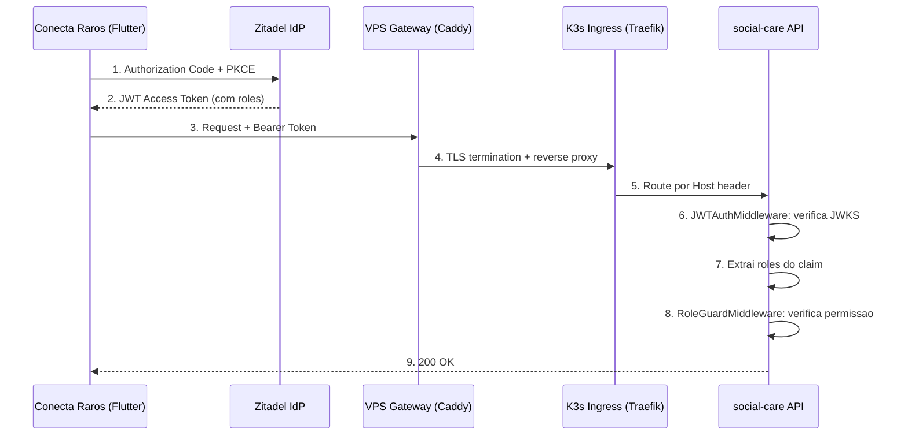
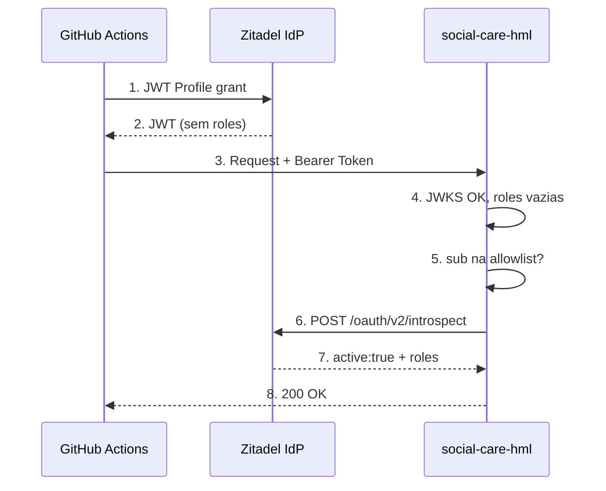

# Seguranca

Modelo de seguranca aplicado aos servicos da ACDG Platform, com foco no servico `social-care`.

---

## Defesa em Profundidade

| Camada | Mecanismo | Onde |
|--------|-----------|------|
| 1. Rede | Tailscale (WireGuard) — rede privada overlay | VPS <> K3s |
| 2. TLS | Caddy — certificado Let's Encrypt automatico | VPS Gateway |
| 3. Assinatura | JWKS — verifica assinatura RSA do JWT | Backend (middleware) |
| 4. Autorizacao | RBAC — roles no JWT ou via introspection | Backend (middleware) |
| 5. Allowlist | IDs de service accounts autorizados (Bitwarden) | Backend (middleware) |
| 6. Secrets | Bitwarden Secret Manager — zero secrets em Git | K8s (operator) |
| 7. Isolamento | Banco de dados e deployment separados por ambiente | K8s |

---

## Identity Provider — Zitadel

| Item | Valor |
|------|-------|
| Tipo | Self-hosted (K3s via Helm chart + FluxCD) |
| Dominio | `https://auth.acdgbrasil.com.br` |
| Console | `https://auth.acdgbrasil.com.br/ui/console` |
| JWKS URI | `https://auth.acdgbrasil.com.br/oauth/v2/keys` |
| Token Endpoint | `https://auth.acdgbrasil.com.br/oauth/v2/token` |
| Introspect Endpoint | `https://auth.acdgbrasil.com.br/oauth/v2/introspect` |
| Issuer | `https://auth.acdgbrasil.com.br` |
| Projeto | ACDG Platform (ID: `363109883022671995`) |

### Applications

| App | Tipo | Uso | Auth Method |
|-----|------|-----|-------------|
| `social-care` | Native (OIDC) | Flutter app — login de usuarios | PKCE |
| `social-care-web` | User Agent (OIDC) | Web app (futuro) | PKCE |
| `social-care-introspect` | API | Backend HML — Token Introspection | Basic (client_id:client_secret) |

### Roles

| Role | Descricao | Permissoes |
|------|-----------|------------|
| `social_worker` | Assistente social | CRUD completo |
| `owner` | Responsavel/familiar | Somente leitura |
| `admin` | Administrador | Acesso completo |

---

## Autenticacao — JWT via JWKS

### Fluxo: Usuario humano (Authorization Code + PKCE)



### Como funciona

1. Na inicializacao, o backend busca as chaves publicas do Zitadel via `JWKS_URL`
2. Cada request passa pelo `JWTAuthMiddleware`:
   - Extrai token do header `Authorization: Bearer`
   - Verifica assinatura RSA contra JWKS
   - Verifica expiracao (`exp`)
   - Extrai `sub` e roles do claim `urn:zitadel:iam:org:project:roles`
3. Um `AuthenticatedUser` e armazenado no `Request.storage`

### Claim de roles (formato Zitadel)

```json
{
  "sub": "363680401698324682",
  "urn:zitadel:iam:org:project:roles": {
    "social_worker": {
      "363109592139300987": "acdg.auth.acdgbrasil.com.br"
    }
  }
}
```

---

## Autorizacao — RBAC

O `RoleGuardMiddleware` verifica roles por grupo de rotas:

| Controller | Operacao | Roles |
|------------|----------|-------|
| HealthController | `GET /health`, `GET /ready` | Publico |
| PatientController | `GET` | `social_worker`, `owner`, `admin` |
| PatientController | `POST`, `PUT`, `DELETE` | `social_worker` |
| AssessmentController | `PUT` | `social_worker` |
| CareController | `POST`, `PUT` | `social_worker` |
| ProtectionController | `POST`, `PUT` | `social_worker` |
| LookupController | `GET` | `social_worker`, `owner`, `admin` |

---

## Token Introspection (HML)

### O problema

O Zitadel nao inclui roles no JWT para service users autenticados via JWT Profile grant (RFC 7523). Isso impede service accounts de acessar endpoints protegidos por role.

### A solucao

Quando o JWT nao contem roles, o backend chama Token Introspection (RFC 7662) do Zitadel.



### Condicoes de ativacao

O introspection so executa quando TODAS as condicoes sao verdadeiras:

1. JWT valido (assinatura verificada por JWKS)
2. JWT nao contem roles no claim
3. Env vars `ZITADEL_INTROSPECT_CLIENT_ID` e `ZITADEL_INTROSPECT_CLIENT_SECRET` definidas
4. `sub` do JWT na allowlist `ALLOWED_SERVICE_ACCOUNTS`

Em producao, as env vars de introspection nao estao definidas — introspection nunca executa.

---

## Allowlist de Service Accounts

Lista explicita de user IDs autorizados a usar introspection, armazenada no Bitwarden (nunca hardcoded):

```
ALLOWED_SERVICE_ACCOUNTS=363680401698324682
```

### Tres camadas de protecao

| Camada | Mecanismo | Protege contra |
|--------|-----------|----------------|
| JWKS | Assinatura RSA | JWTs forjados |
| Env vars | Introspection so se configurado | Producao nunca faz introspection |
| Allowlist | IDs no Bitwarden | Mesmo com env vars, so IDs autorizados passam |

---

## Gestao de Secrets

Principio: zero secrets em Git. Todo secret e armazenado no Bitwarden Secret Manager e sincronizado via operator.

### Inventario (HML)

| Secret Bitwarden | K8s Secret | Env var |
|------------------|------------|---------|
| `SC_HML_DB_PASSWORD` | `postgres-hml-credentials` | `DB_PASSWORD` |
| `SC_HML_INTROSPECT_CLIENT_ID` | `zitadel-introspect-hml-credentials` | `ZITADEL_INTROSPECT_CLIENT_ID` |
| `SC_HML_INTROSPECT_CLIENT_SECRET` | `zitadel-introspect-hml-credentials` | `ZITADEL_INTROSPECT_CLIENT_SECRET` |
| `SC_HML_ALLOWED_SERVICE_ACCOUNTS` | `service-accounts-hml-credentials` | `ALLOWED_SERVICE_ACCOUNTS` |

### Inventario (Producao)

| Secret Bitwarden | K8s Secret | Env var |
|------------------|------------|---------|
| `SC_DB_PASSWORD` | `postgres-credentials` | `DB_PASSWORD` |

Producao nao tem secrets de introspection nem allowlist.

### Politica de rotacao

- **DB_PASSWORD:** a cada 90 dias
- **Introspection credentials:** ao regenerar client_secret no Zitadel
- **Allowlist:** ao adicionar/remover service accounts
- **RSA key do service user:** expira em 12 meses

---

## Isolamento Producao vs Homologacao

| Aspecto | Producao | Homologacao |
|---------|----------|-------------|
| URL | `social-care.acdgbrasil.com.br` | `social-care-hml.acdgbrasil.com.br` |
| Banco | `social_care` (PostgreSQL dedicado) | `social_care_hml` (PostgreSQL dedicado) |
| Imagem | `ghcr.io/.../svc-social-care:v0.8.0` | `ghcr.io/.../svc-social-care:v0.8.0` |
| Introspection | Desabilitado | Habilitado + allowlist |
| Dados | Reais (pacientes) | Ficticios (testes) |
| Reset de banco | Nunca | Automatico (domingos 03:00 UTC) |
| Resources | 512Mi RAM / 500m CPU | 256Mi RAM / 250m CPU |

---

## Matriz de Ameacas

| Ameaca | Mitigacao | Status |
|--------|-----------|--------|
| JWT forjado | JWKS verifica assinatura RSA | Mitigado |
| Token expirado reutilizado | `exp` verificado em cada request | Mitigado |
| Escalacao de privilegio | RoleGuardMiddleware por grupo de rotas | Mitigado |
| Service account em producao | Sem introspector — sem roles — 403 | Mitigado |
| Service account nao autorizado | Allowlist bloqueia IDs nao registrados | Mitigado |
| Secrets em Git | Bitwarden SM + operator + CI guard | Mitigado |
| Man-in-the-middle VPS <> K3s | Tailscale WireGuard | Mitigado |
| Acesso direto ao cluster | K3s nao expoe portas — apenas via Tailscale | Mitigado |
| Chave RSA comprometida | Revogar no Zitadel + remover da allowlist | Procedimento |
| Client secret vazado | Regenerar no Zitadel + atualizar Bitwarden | Procedimento |
| Contaminacao prod/HML | Bancos completamente isolados | Mitigado |
| SQL injection | SQLKit com prepared statements | Mitigado |

---

## Referencia de Arquivos

### Backend (social-care)

| Arquivo | Descricao |
|---------|-----------|
| `IO/HTTP/Auth/ZitadelJWTPayload.swift` | Decodifica claim de roles |
| `IO/HTTP/Auth/AuthenticatedUser.swift` | Modelo de usuario autenticado |
| `IO/HTTP/Auth/TokenIntrospector.swift` | Protocolo + implementacao Zitadel + allowlist |
| `IO/HTTP/Middleware/JWTAuthMiddleware.swift` | Validacao JWT + fallback introspection |
| `IO/HTTP/Middleware/RoleGuardMiddleware.swift` | RBAC por grupo de rotas |
| `IO/HTTP/Middleware/AppErrorMiddleware.swift` | Traduz erros para JSON |
| `IO/HTTP/Bootstrap/configure.swift` | Setup de JWKS, introspector, middlewares |

### Infraestrutura (edge-cloud-infra)

| Arquivo | Descricao |
|---------|-----------|
| `apps/social-care.yaml` | Deployment + Service + Ingress (prod) |
| `apps/social-care-hml.yaml` | HML completo (app + DB + secrets + CronJob) |
| `apps/postgres.yaml` | PostgreSQL producao + BitwardenSecret |

---

## RFCs e Padroes

| Padrao | Descricao | Uso |
|--------|-----------|-----|
| RFC 7519 | JSON Web Token (JWT) | Formato do access token |
| RFC 7517 | JSON Web Key Set (JWKS) | Verificacao de assinatura |
| RFC 7523 | JWT Profile for OAuth 2.0 | Autenticacao de service accounts |
| RFC 7662 | Token Introspection | Fallback para obter roles |
| RFC 7636 | PKCE | Login de usuarios humanos |
| OpenID Connect | OIDC Core | Protocolo de autenticacao |
| OWASP API Security | Top 10 | Referencia para mitigacoes |
